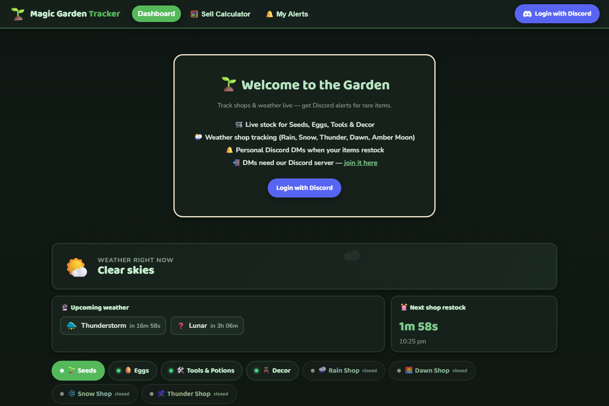
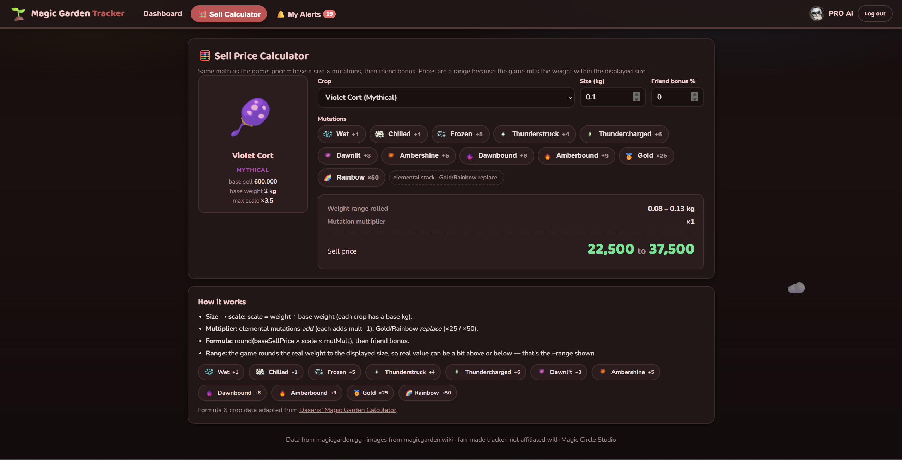
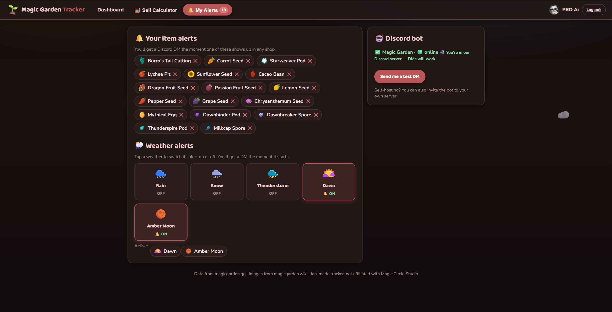

# 🌱 Magic Garden Tracker

A little website I made to keep an eye on the Magic Garden shops and weather.
It logs into Discord, shows everything that's in stock, and DMs you when
something you care about shows up.

No self-bot, no channel scanning — it reads the game's own API
(`magicgarden.gg/platform/v1/...`) directly, same data the official site uses.

| Dashboard | Sell Calculator |
|---|---|
|  |  |

| Notifications |
|---|
|  |

## What it does

- **Dashboard** — current weather with a countdown, what's coming next, next
  shop restock, and every shop with live stock numbers and prices. Weather
  shops (Rain, Snow, Thunder, Dawn, Amber) appear while that weather is
  running, and **stay browsable after it ends** from a saved copy — so you can
  bell them anytime.
- **🔔 Alerts** — tap the bell on any item and the bot DMs you when it
  restocks. Weather works the same: tap a weather card and you'll know the
  moment it starts. It only pings on real changes, so no spam.
- **🧮 Sell Calculator** — pick a crop, type the size, tick your mutations,
  get the sell price range. Real game formula, icons for every mutation
  (same math Daserix' calculator uses — credit below).
- **Dark mode** — moon button up top. Remembers your choice.
- Works on phones and tablets too.

## Running it

Node 20 or newer. No npm install — zero dependencies.

```
cd website
node server.js
```

Then open `http://192.168.1.69:8000` (or whatever IP/port you set).

## Setting up Discord (one time)

Copy `config.example.json` to `config.json` and fill in three things from the
[Discord Developer Portal](https://discord.com/developers/applications):

1. **client_id / client_secret** — from your app's OAuth2 page. On that same
   page, add `http://192.168.1.69:8000/callback` under Redirects.
2. **bot_token** — Bot page → Reset Token. Paste it in and save — the server
   picks it up without a restart and the bot goes 🟢 online.
3. **Join the server** — at login the site now asks for permission to add you
   to our server automatically, so most people won't have to do anything.
   If the auto-join can't happen (or you declined), the Alerts page shows a
   join button: https://discord.gg/WzzkZS8CkB
   (Self-hosting for your own crew? The Alerts page also has a normal bot
   invite link.)

Hit **Send me a test DM** on the alerts page to check it all works.

## How notifications work

A poller checks the game API every 10 seconds and keeps a snapshot of what's
in stock and which weather is active. When something **changes** — an item
goes from 0 stock to in stock, or a new weather window starts — everyone who
belled that item/weather gets a DM with the details. That's why it never
spams: it only messages on transitions, and it remembers where it left off
across restarts.

If several of your items restock at once you get **one** DM, with the
priciest item first and a `> Name - stock` list on top — the mention pings
you on that first message. Each item gets its own embed with its picture.

## Files that matter

```
server.js             the whole backend (API proxy, login, poller, bot)
config.json           your secrets - NOT in git
public/               the website itself
item_meta.json        item names + wiki image links
crop_data.json        crop stats for the calculator
mutation_data.json    mutation multipliers + icons
shop_catalogs.json    saved weather-shop catalogs (runtime)
tools/                the scripts that generate the data files
docs/                 the screenshots you see above
```

`item_meta.json` and `shop_catalogs.json` grow on their own: when the game
shows a new item (or a weather shop opens), the server notices, grabs the
wiki image, and remembers it for next time.

## Changing IP or port

Edit `config.json` (`port`), and make sure the redirect URI in the Discord
portal matches. That's the usual suspect when login loops back with an error.

## Credits

- Shop/weather data from the game's platform API
- Item images from [magicgarden.wiki](https://magicgarden.wiki)
- Calculator formula and crop stats from
  [Daserix' Magic Garden Calculator](https://daserix.github.io/magic-garden-calculator/)

Not affiliated with Magic Circle Studio. It's a fan tool.
